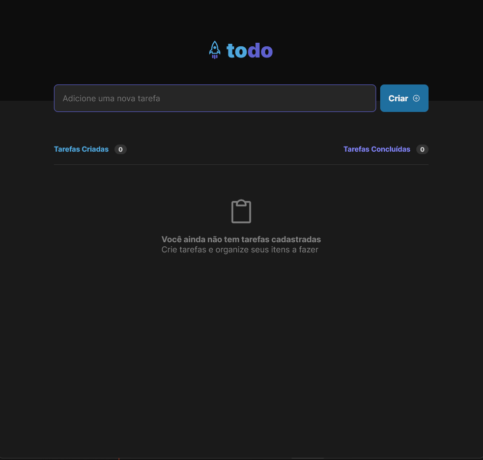
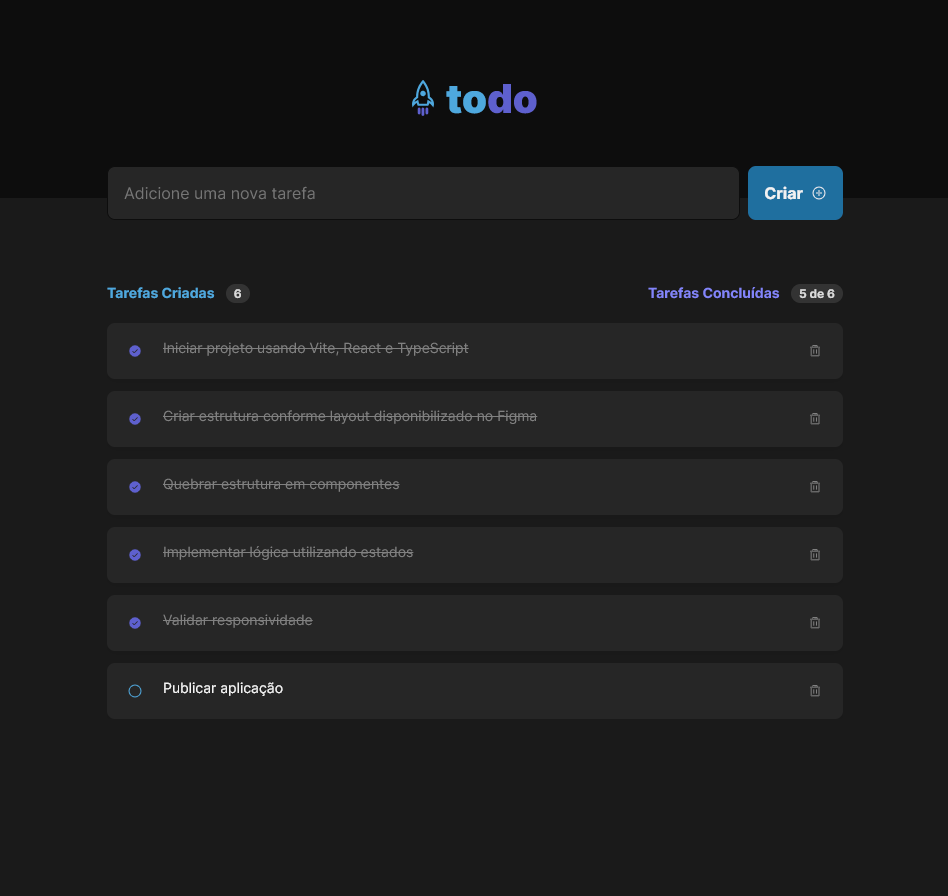

# Todolist

Projeto proposto no módulo 01 do curso Ignite da RocketSeat

## Sobre o desafio

O desafio consiste na criação de uma lista de tarefas.

### Funcionalidades
- Marcar e desmarcar uma tarefa como concluída
- Remover uma tarefa da listagem
- Mostrar o progresso de conclusão das tarefas

## Preview

## Conceitos reforçados

- Estados
- Imutabilidade do estado
- Listas e chaves no ReactJS
- Propriedades
- Componentização

## Stacks do projeto:
- TypeScript
- React
- HTML
- CSS
- Vite
